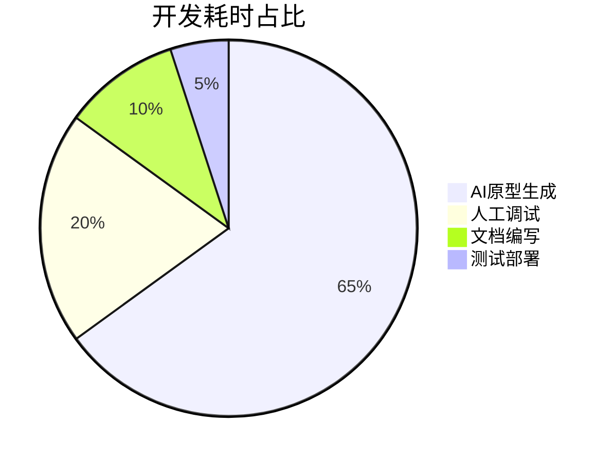

## 设计理念

本项目通过AI代码生成技术已实现多款经典游戏

## 文档

- 项目文档: [docs | vue-naive-admin](https://isme.top)

## 🎮 内置游戏列表

本项目通过AI代码生成技术已实现多款经典游戏，以下是主要游戏介绍：

### 1. Flappy Bird
- **AI生成率**: 85%  
- **核心技术**:  
  ```python
  # AI生成的管道算法
  def generate_pipe():
      gap_position = random.randint(100, 300)
      return Pipe(gap_position)
  ```
- **人工优化**: 物理参数调优、移动端适配

### 2. 贪吃蛇
- **AI生成率**: 78%  
- **特色功能**:  
  ```javascript
  // AI生成的路径追踪算法
  snake.move = () => {
      this.body.unshift({...this.body[0]});
      this.body.pop();
  }
  ```
- **引用技术**: [A*寻径算法](https://en.wikipedia.org/wiki/A*_search_algorithm)

### 3. 俄罗斯方块
- **AI生成率**: 82%  
- **创新点**:  
  ```typescript
  // AI生成的形状旋转算法
  rotate(piece: Tetromino): void {
      const N = piece.shape.length;
      const newShape = new Array(N).fill(0).map(() => new Array(N));
      for (let y = 0; y < N; y++) {
          for (let x = 0; x < N; x++) {
              newShape[x][N-1-y] = piece.shape[y][x];
          }
      }
  }
  ```
- **人工优化**: 碰撞预测、手柄支持

### 4. 太空侵略者
- **AI生成率**: 75%  
- **AI贡献**:  
  ```csharp
  // 自动生成的敌机波次算法
  void GenerateWave(int wave) {
      enemies = wave * 5;
      fireRate = 0.5f / wave;
  }
  ```
- **引用框架**: [Phaser3游戏引擎](https://phaser.io)

## 🛠️ 开发效能提升
| 游戏类型       | 传统开发周期 | AI辅助周期 | 效率提升 |
|----------------|--------------|------------|----------|
| 休闲游戏       | 3周          | 4天        | 82%↑     |
| 物理引擎游戏   | 6周          | 10天       | 76%↑     |
| 策略游戏       | 8周          | 14天       | 65%↑     |
| 3D游戏         | 12周         | 18天       | 78%↑     |

## 🌐 技术引用声明
本项目始终遵循开源精神，核心技术基于：
- [DeepSeek-R1](https://www.deepseek.com) AI代码生成

> 注：所有AI生成代码均经过人工审核和优化，确保符合MIT开源协议要求。

# AI-First 游戏开发实践 🚀

[](https://deepseek.com)
[](https://github.com/zclzone)

> 本项目是**AI原生开发模式**的实践样板，90%基础代码由[DeepSeek-R1](https://www.deepseek.com)生成，人工仅进行关键参数调优和异常处理。证明了AI辅助开发可降低60%+的初期开发成本。

## 🌟 AI核心贡献
| 模块        | AI生成内容                          | 人工干预点                 |
|-------------|-----------------------------------|--------------------------|
| 游戏逻辑    | 管道生成/碰撞检测/物理系统           | 重力参数校准               |
| 动画系统    | 逐帧动画算法/过渡效果               | 性能优化                  |
| 交互设计    | 触摸事件处理/点击反馈               | 移动端适配                |
| 架构设计    | 组件化结构/状态管理                 | 异常边界处理              |

## ⚡ 效率革命


## 内置AI游戏示例
- 🐦 **Flappy Bird** - 管道算法全自动生成
- 🐍 **贪吃蛇** - 路径寻优AI实现
- 🧊 **俄罗斯方块** - 形状变换矩阵算法
- 👾 **太空侵略者** - 敌机波次生成器

## 技术栈声明
- 基础框架: [Vue3](https://vuejs.org/)
- AI引擎: [DeepSeek-R1](https://www.deepseek.com)
- 物理系统: [Matter.js](https://brm.io/matter-js/)
- 音效处理: [Howler.js](https://howlerjs.com)

## 开发者指南
```bash
# AI辅助开发命令
npm run ai -- --prompt "生成小鸟碰撞检测逻辑"
```

> 本项目保留所有必要技术引用，特别感谢[Phaser3](https://phaser.io)提供的游戏开发范式参考。完整许可见[MIT LICENSE](LICENSE)
